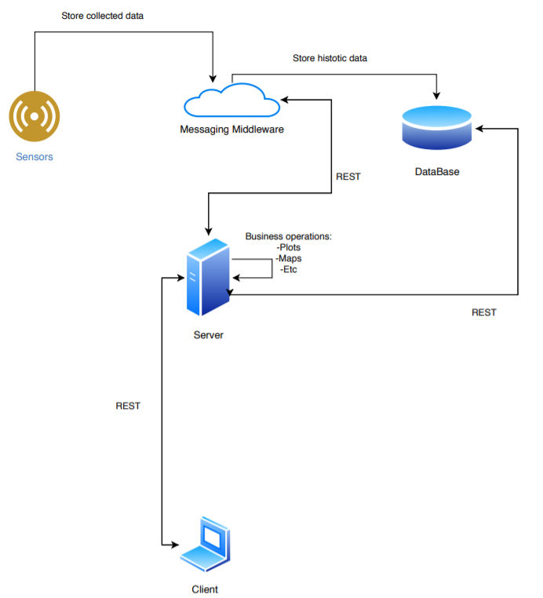

# CityStats

## About

CityStats is a web service minding the environment.
With it you can find the current and historic status of diverse environment variables,
for different cities across Continental Portugal.

This project was created for the pratical assignment of the class [Introduction to Software Engineering 2019/20](https://www.ua.pt/en/uc/12288) from Universidade de Aveiro.

## Team and Roles

- **Team Manager:** Rita Ferrolho
- **Product Owner:** Rita Ferrolho
- **Architect:** Diogo Silveira
- **DevOps master:** Miguel Matos
- **Developer:** All the participants involved

## User Stories
| User | Description | 
| ---- | ----------- |
| João | Engenheiro ambiental da APA, pretende aceder aos dados associados às concentrações de CO em locais específicos, assim como aos dados históricos dessas concentrações
| Pedro | Investigador da área da saúde auditiva, precisa de saber os valores de ruído correspondentes a cada cidade, por ordem decrescente, assim como os dados históricos
| Andreia | Trabalha para a Câmara Municipal de Aveiro como vereadora do ambiente, e pretende por isso obter informações sobre vários fatores, incluindo gases, ruído e aquecimento
| Esteves | Agente da Quercus, procura investigar o impacto dos recentes e numerosos incêndios que ocorreram em Portugal
| Soraia | Funcionária do Ministério do Ambiente, está encarregada de liderar uma investigação sobre a acidez da chuva em Portugal
| Celina | Médica de pulmões no Hospital Universitário de Coimbra, pretende medir a concentração de partículas finas e do ozono troposférico em locais diferentes

## Architecture
### Architecture Diagram


## Usage
### Generator

To obtain the values from the cities, we used a python generator that generates random numbers for each variable. 
To use this generator all you need is to run:
```bash
$ python3 generator/generator.py
``` 

The program will wait 20 seconds after each city and will run until it's manually stopped with CTRL+C.

### CityStats
The file ``cityStats/dockerun.sh`` was created to run and deploy automatically to the server.

```bash
$ ./cityStats/dockerun.sh
```

To access the web application you need to access ``deti-engsoft-09.ua.pt:8080/``, 
to access the API you need to access ``deti-engsoft-09.ua.pt:8080/api/v1/``

## Installation

To use the python generator you need [pika](https://pika.readthedocs.io/en/stable/).

```bash
$ pip install pika
```

## Contributing
Pull requests are welcome. For major changes, please open an issue first to discuss what you would like to change.

Please make sure to update tests as appropriate.

## License
This project is licensed under the MIT License - see the [LICENSE](LICENSE) file for details.
